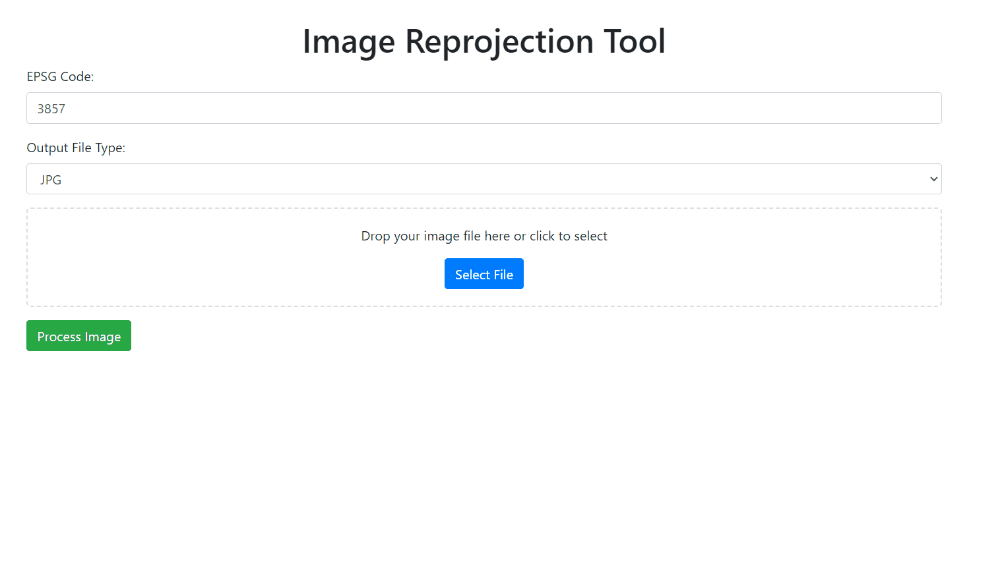
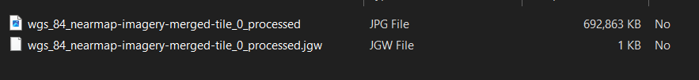

# Geospatial Image Reprojection Web Application

This web application allows users to upload geospatial imagery files, reproject them to a specified EPSG code, and download the processed images along with associated geocoordinate files. The application is built using Flask, Rasterio, and PyProj.


## Overview


## Jpg Output



## Features
- Upload geospatial imagery files (GeoTIFF format).
- Reproject images to a specified EPSG code.
- Download the reprojected images in different formats (JPEG, PNG, TIFF).
- Generate and download associated geocoordinate files (.jgw or .tfw).

## Requirements

- Python 3.x
- Flask
- Rasterio
- PyProj
- Pillow
- Werkzeug
- TQDM

## Installation

1. Clone the repository:
   ```bash
   git clone https://github.com/your-username/geospatial-image-reprojection.git
   cd geospatial-image-reprojection
   ```

Create a virtual environment:

 ```bash
python -m venv venv
source venv/bin/activate  # On Windows use `venv\Scripts\activate`
```

Install the required packages:

 ```bash
pip install -r requirements.txt
```

Usage
Start the Flask application:

 ```bash
python app.py
```

Open your web browser and navigate to http://127.0.0.1:5000.

Use the web interface to upload your geospatial image, specify the EPSG code, and select the desired output file format.

After processing, download the ZIP file containing the reprojected image and the geocoordinate file.

Endpoints
GET /
Renders the main upload interface.

POST /process-image

Processes the uploaded image:

Parameters:
 ```bash
file: The geospatial image file (GeoTIFF format).
epsgCode: The desired EPSG code for reprojection.
outputType: The desired output file type (jpg, jpeg, png, tif, tiff).
Response: A JSON object with the URL to download the processed files.
GET /download/<filename>
Downloads the processed ZIP file.

Project Structure
bash
Copy code
geospatial-image-reprojection/
│
├── app.py                # Main Flask application
├── templates/
│   └── index.html        # HTML template for the upload interface
├── uploads/              # Directory for uploaded files
├── processed/            # Directory for processed files
├── requirements.txt      # Python package dependencies
└── README.md             # This README file
 ```

License
This project is licensed under the MIT License. See the LICENSE file for details.

